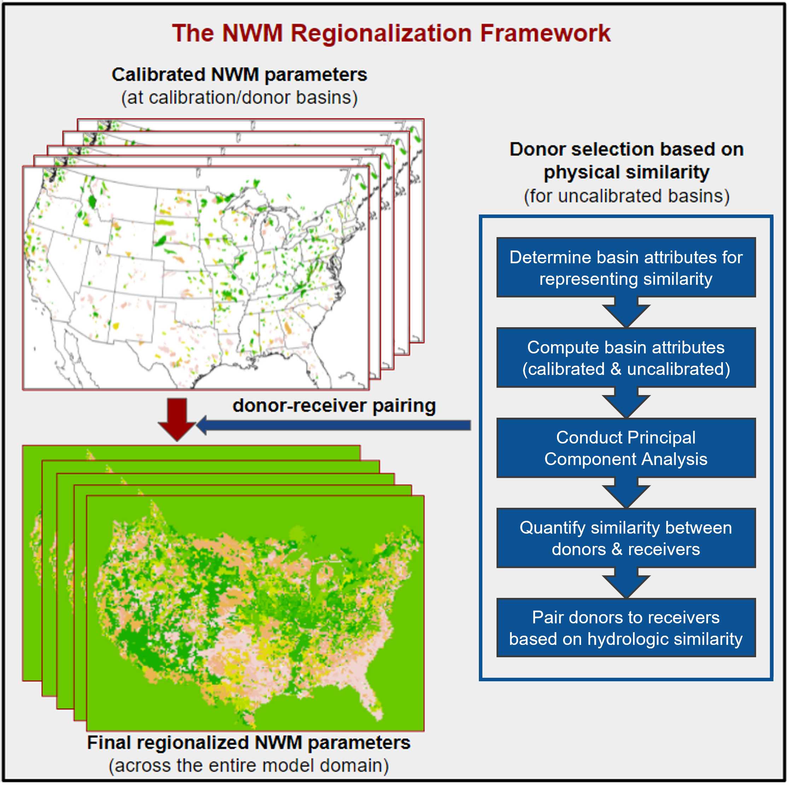

---
html_theme.sidebar_secondary.remove:
sd_hide_title: true
---

<!-- CSS overrides on the homepage only -->

(homepage)=
# ngen-regionalization: Formulation and parameter regionalization for NextGen

  <!-- Start Hero Left -->
  <h2 style="font-size: 60px; font-weight: bold; margin: 2rem auto 0;">ngen-regionalization</h2>
  <h3 style="font-weight: bold; margin-top: 0;">Formulation and parameter regionalization for NextGen</h3>
  
ngen-regionalization is a Python package for identifying optimal model formulations and parameters for ungauged catchments.

  

      <a href="./user_guide.html" class="homepage-button primary-button">User Guide</a>
      <a href="./faq.html" class="homepage-button secondary-button">See FAQ</a>
  

  

      <a href="./API/index.html" class="homepage-button-link">See API Reference →</a>
  

  <!-- End Hero Left -->

  <!-- Start Hero Right -->

<!-- grid ended above, do not put anything on the right of markdown closings -->

  <!-- End Hero Right -->

  <!-- End Hero -->

----

<!-- Keep in markdown to generate headerlink -->
# Role in the NWM Ecosystem

  <!-- Start Hero Left -->

<!-- grid ended above, do not put anything on the right of markdown closings -->

  <!-- End Hero Left -->

  <!-- Start Hero Right -->
  <h3 style="font-weight: bold; margin-top: 0;">A critical tool for forecast skill</h3>
  
Hydrologic models benefit strongly from calibration. Tools in this repository
  make the most out of limited observational data by intelligently transferring optimal
  parameter sets beyond calibrated catchments.

  <!-- End Hero Right -->

  <!-- End Hero -->

# Key Features

:::::{grid} 1 1 2 2
:gutter: 5

::::{grid-item-card}
:shadow: none
:class-card: sd-border-0

:::{image} _static/index/formulation.svg
:::

:::{div} key-features-text
<strong>Formulation Regionalization</strong> 
Ranks NextGen model formulation suitability in ungauged catchments using comparisons to similar gauged catchments.
:::
::::

::::{grid-item-card}
:shadow: none
:class-card: sd-border-0

:::{image} _static/index/parameterization.svg
:::

:::{div} key-features-text
<strong>Parameterization Regionalization</strong> 
Estimates parameter values for ungauged catchments by leveraging calibrations from similar gauged catchments.
:::
::::

::::{grid-item-card}
:shadow: none
:class-card: sd-border-0

:::{image} _static/index/cluster.svg
:::

:::{div} key-features-text
<strong>Clustering</strong> 
Multiple methods available to group calibrated catchments into clusters based on shared hydrologic characteristics.
:::
::::

::::{grid-item-card}
:shadow: none
:class-card: sd-border-0

:::{image} _static/index/diagnostic.svg
:::

:::{div} key-features-text
<strong>Diagnostic Plots</strong> 
Generates plots and maps that explain why specific formulations and parameters were chosen.
:::
::::

::::{grid-item-card}
:shadow: none
:class-card: sd-border-0

:::{image} _static/index/scale.svg
:::

:::{div} key-features-text
<strong>Scalable</strong> 
Efficiently allocates computational resources to handle workflows from small watersheds up to CONUS-wide analyses.
:::
::::

::::{grid-item-card}
:shadow: none
:class-card: sd-border-0

:::{image} _static/index/config.svg
:::

:::{div} key-features-text
<strong>Customizable</strong> 
Gives users full control over every step through easily editable configuration files.
:::
::::
:::::

:::{toctree}
:maxdepth: 1
:hidden:

User Guide<user_guide.rst>
FAQ<faq.rst>
Config Builder<config_builder/index.rst>
API <API/index.rst>
:::
