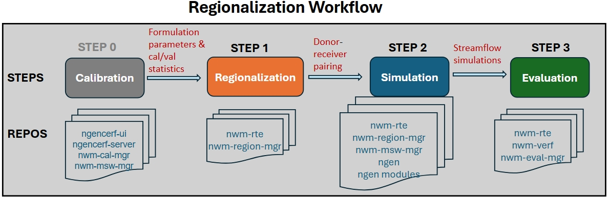

# User Guide

## Overview of regionalization workflow

The regionalization workflow includes the following steps:
 - **STEP 1**: formulation & parameter regionalization (via nwm-region-mgr)
 - **STEP 2**: regionalized NGEN simulation setup (via nwm-mswm-mgr) and execution
 - **STEP 3**: evaluation of regionalized simulations (via nwm-eval-mgr)

Prior to running the regionalization workflow, ensure that you have completed the necessary calibration steps and have properly assembled the calibration parameters and statistics and stored them in the appropriate format (see the sample file and schema for [parameters](tech_reference/input_data.rst#calib-param-file) and [statistics](tech_reference/input_data.rst#calval-stats-file))



## Run regionalization in docker

To ensure consistent and reproducible environment, it is recommended that the above end-to-end regionalization workflow 
be executed within containers using an nwm-rte image that is built locally or pulled from a registry (e.g., {{ '[GHCR](https://github.com/{}/nwm-rte/pkgs/container/nwm-rte)'.format(github_org) }}).

To build the RTE Docker image locally, follow the NWM-RTE User Guide {{ '[here](https://github.com/{}/nwm-rte/blob/development/docs/user-guide/get-started.md)'.format(github_org) }}. Note you can skip the download of sample data since it is handled by the setup script `setup_region.sh` discussed below.

Prior to running the regionalization workflow, make sure `docker` is installed on your system and your user account has permissions to access the docker socket. Refer to the [Docker permissions](#docker-permissions) subsection below for details.

### Set up the working environment

The portable script `setup_region.sh` in `nwm-region-mgr`can be used to set up the working environment for running the regionalization workflow in the container.

```bash
# Create and switch to your preferred working directory
mkdir -p ~/test_region
cd ~/test_region
```

{{ setup_script }}

```bash
# Run the setup script to configure the environment for the CONUS domain
chmod +x setup_region.sh
./setup_region.sh

# Display help and available options
./setup_region.sh --help

# Run the setup script to configure the environment for an oCONUS domain
./setup_region.sh --domain ak
./setup_region.sh -d hi
./setup_region.sh -d prvi
```

Running the setup script:

* downloads sample configuration files from `nwm-region-mgr` to the `configs/` subdirectory and replaces the configured placeholder values as needed. These include:
  * `config_general.yaml`: the main configuration file containing general settings for the regionalization workflow.
  * `config_formreg.yaml`: the configuration file containing settings specific to formulation regionalization.  
  * `config_parreg.yaml`: the configuration file containing settings specific to parameter regionalization.
  * `config_ngen.yaml`: the configuration file containing settings specific to running the regionalized NGEN simulation.
  * `config_eval.yaml`: the configuration file containing settings specific to evaluating the regionalized simulation..
* downloads the regionalization scripts from `nwm-rte` to the `nwm-rte/` subdirectory. These include:
  * `run_region.sh` for running the regionalization workflow locally.
  * `sbatch_run_region.sh` for submitting regionalization jobs to compute nodes via Slurm, invoking `run_region.sh` to execute the workflow.
  * `bin_mounted/ngen_rte/run_regionalization.py`, the main Python script for executing the regionalization workflow steps, invoked by `run_region.sh` through `docker run`.
* downloads static and sample data from S3 to the `static_data/` subdirectory, or links `static_data/` to an existing local data source.

#### Set up in INT/EA/UAT clusters

In the INT, EA, and UAT clusters, use the following commands to set up the working environment.

```bash
# Create and switch to the working directory (or another directory where you have read and write permissions)
mkdir -p /ngen-oe/$USER/run_region
cd /ngen-oe/$USER/run_region
```
{{ setup_script }}

```bash
# Make the setup script executable
chmod +x setup_region.sh

# Set up the working environment for the CONUS domain using an existing local data source
# Note here 18 processes is specified for parallel execution based on available CPU cores in these clusters.
./setup_region.sh --alt-data-source /ngencerf-app/nwm-region-mgr/data/inputs --nprocs 18

# Or use the short options
./setup_region.sh -a /ngencerf-app/nwm-region-mgr/data/inputs -p 18

# Set up the working environment for an oCONUS domain (e.g., ak, hi, prvi)
./setup_region.sh -d ak -a /ngencerf-app/nwm-region-mgr/data/inputs -p 18
./setup_region.sh -d hi -a /ngencerf-app/nwm-region-mgr/data/inputs -p 18
./setup_region.sh -d prvi -a /ngencerf-app/nwm-region-mgr/data/inputs -p 18
```

### Test the sample regionalization workflow

From the working directory, run the three regionalization steps below sequentially using one of the two scripts.
- `sbatch_run_region.sh`: submitting jobs to compute nodes via SBATCH (e.g., on INT/EA/UAT). See RTE 
  documentation {{ '[here](https://{}.github.io/nwm-rte/reference/shell/#sbatch_run_region.sh)'.format(github_org) }} for details on usage and available options.
- `run_region.sh`: running jobs directly in the controller node or workspace. See RTE documentation {{ '[here](https://{}.github.io/nwm-rte/reference/shell/#run_region.sh)'.format(github_org) }} for details on usage and available options.

#### Step 1. Run regionalization

a) Run formulation regionalization alone (no parreg):
Typically this step can be skipped since parameter regionalization also runs formulation regionalization as a prerequisite. Prior to running, configure the settings in `configs/config_general.yaml` and `configs/config_formreg.yaml`. 

```bash
# submit to compute nodes (e.g., in INT/EA/UAT clusters)
./nwm-rte/sbatch_run_region.sh configs formreg

# or run directly in controller node or workspace
time ./nwm-rte/run_region.sh -c configs --formreg
```

b) Run parameter regionalization (formreg is also run as a prerequisite):
Prior to running, configure the settings in `configs/config_general.yaml`, `configs/config_formreg.yaml` and `configs/config_parreg.yaml`.

```bash
# submit to compute nodes (e.g., in INT/EA/UAT clusters)
./nwm-rte/sbatch_run_region.sh configs parreg

# or run directly in controller node or workspace
time ./nwm-rte/run_region.sh -c configs --parreg
```
#### Step 2. Run NGEN
Run NGEN simulations. Prior to running, configure the settings in `configs/config_general.yaml` and `configs/config_ngen.yaml`.


```bash
# submit to compute nodes (e.g., in INT/EA/UAT clusters)
./nwm-rte/sbatch_run_region.sh configs ngen

# or run directly in controller node or workspace
time ./nwm-rte/run_region.sh -c configs --ngen
```

#### Step 3. Run Evaluation
Run an evaluation. Prior to running, configure the settings in `configs/config_eval.yaml`.
```bash
# submit to compute nodes (e.g., in INT/EA/UAT clusters)
./nwm-rte/sbatch_run_region.sh configs eval

# or run directly in controller node or workspace
time ./nwm-rte/run_region.sh -c configs --eval
``` 

#### Run all steps in one command
Users may prefer running the above steps sequentially in separate jobs so they can inspect the outputs from each step before proceeding to the next step. However, it is possible to run all three steps in one command as shown below:

```bash
# submit to compute nodes (e.g., in INT/EA/UAT clusters)
./nwm-rte/sbatch_run_region.sh configs parreg ngen eval

# or run directly in controller node or workspace
time ./nwm-rte/run_region.sh -c configs --parreg --ngen --eval
```
Note: When using `run_region.sh`, the short flags `-f`, `-p`, `-n`, and `-e` can also be used in place of `--formreg`,
`--parreg`, `--ngen`, and `--eval`, respectively. The short flags for these workflow steps are not supported when using `sbatch_run_region.sh`.

```bash
# run all steps with short flags (only for run_region.sh)
time ./nwm-rte/run_region.sh -c configs -p -n -e
``` 
#### Run regionalization with a custom image/tag
By default, the workflow uses the nwm-rte image at {{ '`ghcr.io/{}/nwm-rte`'.format(github_org) }} with the tag `latest`. To use a specific image or image tag (e.g., for testing with a new image), specify the `--image` and `--image-tag` options when running the workflow, as shown below:

```bash
# run all steps with custom image and image tag
./nwm-rte/sbatch_run_region.sh ./configs parreg ngen eval --image nwm-rte --image-tag debug
# or
./nwm-rte/sbatch_run_region.sh ./configs parreg ngen eval -i nwm-rte -t debug
# or 
./nwm-rte/run_region.sh -c configs -p -n -e -i nwm-rte -t debug
```

### Customize and run your own regionalization workflow
 - Prior to running your own regionalization workflow, it is hightly recommded to review documentation on [Technical Reference](tech_reference/index.md) and [Configuration](config_builder/index.md), as well as the [Notes and best practices](#notes-and-best-practices) below, to understand the available configuration options and how to customize the workflow for your specific application.
 - Prepare input data files. Refer to the [Input Data](tech_reference/input_data.rst) subsection for details. 
   - Calibration/validation statistics can be collected from earlier ngenCERF calibration runs using the commands below, which will generate a csv file (in your current run directory) containing the statistics for all specified calibration job IDs, along with another csv file listing the corresponding calibrated parameter sets. These files can then be used in the regionalization configuration files.
      ```bash
        ngencerf regionalization 609 610 # where 609 and 610 are example calibration job IDs

        # or specify a list of calibration job IDs in a text file
        ngencerf regionalization --id-file job_ids.txt
      ```
 - Adjust configuration files in `configs/` to set up your desired regionalization experiment. Refer to the 
[Configuration](config_builder/index.md) tab for details on each config file and available options.
 - Follow Steps 1-3 above to execute the regionalization workflow.

### Example application: comparing different regionalization methods
In this section, we will walk through an example application where we compare gower vs. kmeans clustering for 
parameter regionalization in VPU 09 (see CONUS VPU map in [Paratermeter regionalization](#parameter-regionalization)), 
using selected ngen and StreamCat attributes.

#### 0. Prepare configuration files
We will start from the sample workflow above. First copy the configuration files to a new folder to avoid overwriting 
the original files, e.g.:

```bash
cp -r configs/ test1_configs/
```

#### 0.1 Update `test1_configs/config_general.yaml`
 - Set **general.vpu** to '09'
 - Set **general.run_name** to a new name: *test1*. This will be used to name the output folder for this experiment
  (e.g., `outputs/region/test1/`)

#### 0.2 Update `test1_configs/config_parreg.yaml`
 - Set **general.attr_dataset_list** to *['ngen','streamcat']* as the attribute datasets for computing catchment similarity
 - Set **general.algorithm_list** to *['gower', 'kmeans']*. This will run parameter regionalization using both algorithms sequentially.
 - Set **donor.buffer_km** to 100 (instead of 200) to use a smaller donor search neighbourhood (around the VPU) for this experiment
 - Select specific attributes from each dataset using the attribution selection file
   - copy sample attribute selection files from `/ngencerf-app/nwm-region-mgr/data/inputs/region/attr_config/` to working directory
   ```bash
    cp -r /ngencerf-app/nwm-region-mgr/data/inputs/region/attr_config .
   ```
   - For **ngen**: use the file `attr_selection_ngen.csv`. Set the **select** column to 1 for desired attributes and to 0 for others. Here we select all available ngen attributes except for centroid_x, centroid_y, impervious, ISLTPY, and IVGTYP. Then upate the field **attr_datasets.ngen.attr_select_file** to reflect the new location of this file (e.g., `{base_dir}/attr_config/attr_selection_ngen.csv`). 
   - For **streamcat**: use the file `attr_selection_streamcat.csv`. Set the **select** column to 1 for desired attributes and to 0 for others. Here we select the following attributes: BFI, DamDens, Perm, RckDep, WtDep, PctCarbResid, PctEolCrs, PctWater, Precip, Tmax, Tmean, Tmin, RdDens, Runoff, Clay, Sand, Precip_Minus_EVT. Then update the field **attr_datasets.streamcat.attr_select_file** to reflect the new location of this file (e.g., `{base_dir}/attr_config/attr_selection_streamcat.csv`).
   - Alternatively, we can also specify selected attributes directly in the config file by editing the fields **attr_datasets.ngen.attr_list** and **attr_datasets.streamcat.attr_list**, respectively, for ngen and StreamCat. 
 - Set **donor.metric_eval_period.value** to 'valid' to use validation period statistics for donor selection
 - Set **snow_cover.threshold** to 10 to define catchment snowiness category based on 10% (mean annual) snowcover
 - Edit **output.params.plots.columns_to_plot** to include a couple of CFE parameters to visualize spatial patterns (e.g., 'b' and 'slope')
 - Edit **output.attr_data_final.plots.columns_to_plot** to include some selected attributes to visualize spatial patterns. Specifically, 
   - remove the HLR attributes, since HLR is not chosen for this experiment
   - change *streamcat_Elev* to *streamcat_Perm*, since *Elev* is not selected in **attr_datasets.streamcat.attr_list** 
   - add a few ngen attributes: *ngen_slope*, *ngen_aspect*, *ngen_elevation*
    Note here the attribute names should be prefixed by their dataset names (e.g., 'ngen_' or 'streamcat_').
 - Set **algorithm.algo_general.max_spa_dist** to 1000 to limit the maximum spatial distance for donor selection to 1000 km
 - Set **algorithm.gower.max_attr_dist** to 0.3 to allow a larger maximum attribute distance for donor selection when using gower method. Attribute distances ranges from 0 to 1, with smaller values indicating higher similarity.
 - Set **algorithm.kmeans.n_init** to 5 to increase the number of random initializations for more robust clustering results (with slightly increased computational cost).

#### 1. Run regionalization

Run the regionalization step as in Step 1 above, using the updated configuration files in `test1_configs/`.


```bash
./nwm-rte/sbatch_run_region.sh test1_configs parreg
# or
./nwm-rte/run_region.sh -c test1_configs -p
```

Execution time will take 10-20 minutes depending on available computational resources. While running,
intermediate log messages will be printed to the terminal, while also being written to the log file
`outputs/region/test1.log`, as specified in config_general.yaml.

After completion, check the output folder `outputs/region/test1/`, which contains sub-folders for
 - `attr_data_final/`: files and plots for catchment attributes used in regionalization
 - `formulations/`: regionalized formulation files and diagnostic plots
 - `params/`: regionalized formulation and parameter files and plots for each algorithm, with file names indicating the algorithm used
 - `pairs/`: donor-receiver pair files for each algorithm
 - `spatial_distance/`: matrices of spatial distances between receiver (row) and donor (column) catchments
 - `summary_score/`: summary score for all donor candidates
 - `config_formreg_final.yaml` and `config_parreg_final.yaml`: the final (expanded) configuration files used in this run.

See the **Output Directory Structure** subsection in the [Technical Reference](tech_reference/index.md#output-directory-structure) tab for details on the output directory structure.

See the [Output Tables](tech_reference/output_data.rst) and [Output Plots](tech_reference/output_plot.rst) subsections in the [Technical Reference](tech_reference/index.md) tab for details on output files and plots.

#### 2. Run NGEN simulations

In this experiment, we will run NGEN simulations using the parameter sets derived from both gower and kmeans methods, respectively. 

First, update the `test1_configs/config_ngen.yaml` file as follows:
 - Set **algorithm_list** to `['gower']` for the first run
 - Set **start_time** and **end_time** to define the simulation period (e.g., '2020-10-01T00:00:00' to '2020-10-03T00:00:00'). Here for demonstration purposes we use a 2-day period in October 2020.
 - The other fields can remain unchanged.

Run the NGEN simulation step as in Step 2 above.
```bash
./nwm-rte/sbatch_run_region.sh test1_configs ngen
# or
./nwm-rte/run_region.sh -c test1_configs -n
```

After completion, the simulation outputs will be saved in the folder
`outputs/ngen/regionalization/test1_gower/vpu09/Output/`, where the streamflow outputs can be found in the file `troute_output_202010010000.nc`. Note that the sub-folder name `test1_gower` includes the run_name (here *test1*) and the algorithm used (here *gower*).

Next, update the `test1_configs/config_ngen.yaml` file again to set **algorithm_list** to `['kmeans']` for the second run, while keeping other fields unchanged. Run the NGEN simulation step again.

After completion, the simulation outputs will be saved in the folder
`outputs/ngen/regionalization/test1_kmeans/vpu09/Output/`, where the streamflow outputs can be found in the file `troute_output_202010010000.nc`.

Depending on available computational resources, each NGEN simulation may take up to an hour or more to complete.

Alternatively, you can also run NGEN simulation for both gower and kmeans methods in a single run by setting **algorithm_list** to `['gower', 'kmeans']`.

#### 3. Run evaluation

Finally, we will evaluate the two NGEN simulations against observed streamflow data.

Update the `configs/config_eval.yaml` file as follows:
 - Set **general.location_set_name** to *vpu_09*
 - Set **general.dataset_name** to *[test1_kmeans, test1_gower]*. This defines the names of the two datasets to be evaluated and intercompared, corresponding to the two algorithms used in parameter regionalization.
 - Set **general.nwm_version** to *[ngen, ngen]*. Both simulations use the ngen configuration.
 - Set **general.fcst_start_date** and **general.fcst_end_date** to define the simulation period (e.g., `'2020-10-01T00:00:00'` to `'2020-10-03T00:00:00'`), consistent with the simulation period used above. Both fields should be lists with the same length as **dataset_name**, e.g.,
      ```bash
      forecast_start_date: ['2020-10-01 00:00:00', '2020-10-01 00:00:00'] 
      forecast_end_date: ['2020-10-03 00:00:00', '2020-10-03 00:00:00']
      ```
 - Set **general.eval_start_date** and **general.eval_end_date** to define the evaluation period (e.g., `'2020-10-02 00:00:00'` to `'2020-10-03 00:00:00'`). Here we use an 1-day evaluation period (October 2, 2020), to allow a 1-day spin-up period. Both fields should be lists with the same length as **dataset_name**.
 - Set **file_paths.output_dir** to point to the directory where evaluation outputs should be saved. Here we add the **run_name** from regionalization `test1` (e.g., `'{base_dir}/outputs/eval/test1/{location_set_name}'`), to ensure evaluation outputs are also organized by regionalization runs.
 - Update fields in metics and plotting sections as desired. Here we will compute and plot a set of default evaluation metrics: KGE (Kling-Gupta Efficiency), NSE (Nash-Sutcliffe Efficiency), NNSE (Normalized NSE), and Correlation (CORR). Note the **lead_times** fields are not applicable here since we are evaluating simulations.

Note: if you would like to explore other configuration options for evaluation, refer to {{ '[nwm-eval-mgr documentation](https://{}.github.io/nwm-eval-mgr/index.html)'.format(github_org) }} for details.

Run the evaluation step as in Step 3 above.
```bash
./nwm-rte/sbatch_run_region.sh test1_configs eval
./nwm-rte/run_region.sh -c test1_configs -e
```
After completion, evaluation results will be saved in the folder `data/outputs/eval/test1/vpu_09/`, including
 - `joined/`: combined observed and simulated streamflow data for all locations in parquet format; each file corresponds to one dataset (i.e., algorithm)
 - `metrics/`: evaluation metrics tables for all locations in parquet format; each file corresponds to one dataset (i.e., algorithm)
 - `plots/ngen_simulation/`: evaluation plots for all locations, comparing the two algorithms
   - `boxplot/`: boxplots of evaluation metrics across all locations
   - `histogram/`: histograms of evaluation metrics across all locations
   - `spatial_map/`: spatial maps of evaluation metrics for each algorithm
 - `test1_gower/ngen_simulation/`: streamflow time series data for all locations using gower method
 - `test1_kmeans/ngen_simulation/`: streamflow time series data for all locations using kmeans method
 - `usgs/`: observed streamflow time series data for all locations
 - `nwm_eval_config_expanded.yaml`: the final (expanded) configuration file used in this run.

Check the metrics and plots to compare/analyze the performance of the two algorithms in parameter regionalization.

## Run regionalization in local environment

From a developer's perspective, running, testing, and debugging the regionalization workflow in a local environment requires installing the necessary dependencies and setting up the required configuration files on the local machine. The steps below describe how to install the package and configure the workflow for a local, non-containerized environment.

### Installing nwm_region_mgr

Installing nwm_region_mgr requires

 - Python 3.11
 - Python venv (typically included with Python)
 - git

Since nwm_region_mgr is not currently on PyPI, it must be installed from source. To download this repository, run

{{ clone_region_mgr }}

To get the most up-to-date code, switch to the development branch.

```bash
cd nwm-region-mgr
git checkout development
```

Next, create a virtual environment to isolate the dependencies of this library from your base Python environment.

```bash
python3.11 -m venv .venv
source .venv/bin/activate
```

You can then install `nwm-region-mgr`. The following installation options cover the most common use cases:

```bash
# Install the package with the dependencies required for formulation regionalization only
pip install .

# Install the package in editable mode for development
pip install -e .

# Install the package with the additional dependencies required for parameter regionalization
pip install -e .[parreg]

# Install the package with all dependencies, including formulation and parameter regionalization, development, and documentation tools
pip install -e .[parreg,docs,dev]
```

### STEP 1: Run regionalization to produce regionalized formulations and parameters

#### 1) Set up configuration yaml files

Three yaml config files are needed to run regionalization
- **config_general.yaml**: general settings for the overall regionalization process.
- **config_formreg.yaml**: specific settings for the formulation regionalization process.
- **config_parreg.yaml**: specific settings for the parameter regionalization process.

Follow the sample config files ([config_general.yaml](../../configs/config_general.yaml), [config_formreg.yaml](../../configs/config_formreg.yaml), [config_parreg.yaml](../../configs/config_parreg.yaml)) to set up the configurations
for your regionalization application as needed.

Sample input data can be downloaded from {{ '**s3://{}-dev/nwm-tools-data/regionalization/inputs/region**'.format(github_org_lower) }}


#### 2) Run the regionalization

```bash
python -m nwm_region_mgr [CONFIG_DIR] [REG_TYPE]
```
Where:
- [CONFIG_DIR] refers to the directory containing the config files as noted in 1)
- [REG_TYPE] refers to the type of regionalization to run, either 'formreg' (formulation regionalization only) or 'parreg' (parameter regionalization, which also runs formulation regionalization first if not done already). If not specified, the default is 'parreg'.

```bash
python -m nwm_region_mgr configs formreg # to run formulation regionalization only
python -m nwm_region_mgr configs parreg # to run parameter regionalization (and formulation regionalization if not done already)
```

### STEP 2: Run NGEN simulation with regionalized parameters

To avoid complications from building ngen and its submodules locally, we recommend you always run NGEN simulation
with regionalized parameters and formulations from a Docker container. Follow relevant instructions in running NGEN simulation in Docker as noted in the **Run regionalization in Docker** section above. 

Configure NGEN simulation by following the sample config file [config_ngen.yaml](../../configs/config_ngen.yaml)

Sample input data can be downloaded from {{ '**s3://{}-dev/nwm-tools-data/regionalization/data/inputs/ngen**'.format(github_org_lower) }}

### STEP 3: Evaluate NGEN simulation with nwm-eval-mgr

#### 1) Install {{ '[nwm-eval-mgr](https://github.com/{}/nwm-eval-mgr)'.format(github_org) }}
Follow the instructions in the nwm-eval-mgr repository to set up the virtual environment for running evaluations.

#### 2) Set up configurations for evaluation
Configure evaluation by following the sample config file [config_eval.yaml](../../configs/config_eval.yaml)

Sample input data can be downloaded from {{ '**s3://{}-dev/nwm-tools-data/regionalization/data/inputs/eval**'.format(github_org_lower) }}

#### 3) Run evaluation
```bash
source <path_to_nwm_eval_mgr_venv>/bin/activate
python -m nwm_eval configs/config_eval.yaml
```
#### 4) Check outputs
Outputs from evaluation can be found in `file_paths.output_dir` as specified in **config_eval.yaml**

## Develop and build documentation

The project documentation is built with Sphinx and MyST. Several helper scripts under `docs/scripts/` generate content 
used by the documentation, including data schemas, configuration schema documentation, and input/output directory trees.

### Generate documentation content

Run the following scripts from the repository root when updating the corresponding documentation sections.

#### Generate data schemas

`docs/scripts/data_schemas.py` generates input and output data schema documentation in two steps.

First, create draft data description CSV files from sample files stored in S3:

```bash
python docs/scripts/data_schemas.py --step draft
```

Existing description CSV files are preserved, while missing files are created. The draft files are stored under:

```text
docs/scripts/data_desc/inputs/
docs/scripts/data_desc/outputs/
```

Manually update the draft CSV files to provide dataset and variable/column descriptions.

Then generate the RST schema documentation:

```bash
python docs/scripts/data_schemas.py --step schema
```

This reads the sample files from S3 together with the manually updated description CSV files and generates:

```text
docs/source/tech_reference/input_data.rst
docs/source/tech_reference/output_data.rst
```

AWS credentials must be available through environment variables or a `.env` file before running the script.

#### Generate configuration documentation

`docs/scripts/config_schemas.py` generates documentation for the configuration schemas and sample configuration files. It creates example YAML configuration files and Markdown tables describing configuration fields, including their types, descriptions, default values, and examples.

Run:

```bash
python docs/scripts/config_schemas.py
```

The generated documentation is saved to:

```text
docs/source/config_builder/index.md
```

#### Generate S3 directory trees

`docs/scripts/create_dir_tree.py` generates Markdown directory trees for the input and output data stored in S3. The script also adds descriptions to selected files and directories using the `path` and `comment` entries in a CSV file.

By default, it processes the following S3 prefixes:

```text
nwm-tools-data/regionalization/data/inputs/
nwm-tools-data/esmf/
nwm-tools-data/regionalization/data/outputs/
```

and reads comments from:

```text
folder_file_desc.csv
```

Run:

```bash
python docs/scripts/create_dir_tree.py
```

The script generates:

```text
docs/source/tech_reference/input_tree.md
docs/source/tech_reference/output_tree.md
```

To use a different S3 bucket:

```bash
python docs/scripts/create_dir_tree.py --bucket <bucket>
```

To specify different S3 prefixes:

```bash
python docs/scripts/create_dir_tree.py \
    --input-region-prefix <input-region-prefix> \
    --input-ngen-prefix <input-ngen-prefix> \
    --output-prefix <output-prefix>
```

To use a different comments file:

```bash
python docs/scripts/create_dir_tree.py --comments <comments-file>
```

To control number of files displayed per directory:

```bash
python docs/scripts/create_dir_tree.py --max-files-per-dir 5
```

The comments CSV must contain the following columns:

```text
path,comment
```

### Build the documentation

After generating or updating the documentation content, build the Sphinx documentation from the repository root:

```bash
make -C docs html
```

The generated HTML documentation will be available under:

```text
docs/build/
```

Open `docs/build/index.html` in a browser to review the documentation locally.

When developing documentation, regenerate the affected content first, then rebuild the html to verify that generated pages, cross-references, images, and formatting render correctly.

## Notes and best practices

### Formulation regionalization

- Configuration for formulation regionalization is specified in `config_general.yaml` and `config_formreg.yaml`.

- The python module `nwm_region_mgr.formreg` contains functions for performing formulation regionalization.

- Formulation regionalization can be run independently, without requiring parameter regionalization. However,
  parameter regionalization requires formulation regionalization to be completed first.

- If `calib_basins_only` is set to True in the configuration file, only calibrated catchments will be assigned
  formulations. During parameter regionalization, donors will be selected for uncalibrated catchments
  without any formulation constraints, i.e., any calibrated catchment is eligible as a donor. Othwerwise, if
  `calib_basins_only` is set to False, eligible donors will be limited to only those calibrated catchments that
  share the same formulation as the uncalibrated catchment.

- Currently, formulation regionalization relies on calibration/validation statistics only. In the future,
  additional criteria (e.g., physiographic similarity) may be incorporated into the formulation selection process.

### Parameter regionalization

- Configuration for parameter regionalization is specified in `config_general.yaml` and `config_parreg.yaml`.

- The python module `nwm_region_mgr.parreg` contains functions for performing parameter regionalization.

- Currently, four attribute datasets are supported:

  * [NextGen attributes](<https://lynker-spatial.s3-us-west-2.amazonaws.com/hydrofabric/v2.2/hfv2.2-data_model.html>) (available for all domains)
  * [Hydrologic Landscape Regions (HLR) attributes](<https://www.usgs.gov/publications/hydrologic-landscape-regions-united-states>)(only available for conus, ak, and hi domains)
  * [StreamCat attributes](<https://www.epa.gov/national-aquatic-resource-surveys/streamcat-dataset>) (only available for conus)
  * [HydroATLAS attributes](<https://www.hydrosheds.org/hydroatlas>) (available for all domains except hi)

  Users can choose to use any combination of these datasets for regionalization, depending on their availability and relevance to the region of interest. For example, for the AK domain, since HLR and StreamCat attributes are not available, users can choose to use NextGen and HydroATLAS attributes for regionalization.

- Parameter regionalization is carried out separately for each individual VPU, to avoid potential memory issues and
  algorithm inefficiency. A VPU is equivalent to a HUC2 region, except for HUC-03 and HUC-10 that are divided into 
  multiple VPUs. The image below shows all the VPUs in the CONUS domain. Each oCONUS domain (Alaska, Hawaii, Puerto Rico) is treated as a single VPU.

```{figure} _images/conus_vpu_map.jpeg
:alt: VPUs in the CONUS domain
:width: 60%
:align: center
:caption: VPUs in the CONUS domain
:name: fig:vpu-map
```

- Parameter regionalization requires formulation regionalization to be completed first. Hence, for each parameter
  regionalization run, the workflow will first check if the required outputs from formulation regionalization for
  the relevant VPUs already exist; if not, the workflow will run formulation regionalization for the relevant VPUs before
  proceeding with parameter regionalization.

- Parameter regionalization for a given VPU may also rely on formulation-regionalization outputs from neighboring VPUs,
  depending on whether calibration basins from those VPUs fall within the buffer distance specified in the configuration.

#### Docker permissions
When first running the regionalization workflow in INT/EA/UAT clusters, you may encounter permission issues when pulling the nwm-rte image or running the container. This is because your user account may not have permissions to access the docker socket or pull images from the registry. To resolve theses issues, run the following commands from the terminal before submitting your first regionalization job. You only need to do this once, and it will grant the necessary permissions for all future runs. 
```bash
sudo systemctl status docker # check status
sudo systemctl start docker # start docker service if not already running
sudo usermod -aG docker $USER # add user to docker group
newgrp docker # apply group change without logout/login
```

### Running regionalization in INT/EA/UAT clusters

#### Input/output file paths

The current working directory is mounted to the same path in the container during runtime. In `config_general.yaml`, the placeholders `{base_dir}` and `{static_data_dir}` are automatically replaced with the correct paths when the workflow is run. As long as you specify file paths for all inputs and outputs in the configuration files using these placeholders, the 
workflow will be able to correctly locate the files in the container regardless of where your working directory is on the host.

There is a caveat. The placeholders `{base_dir}` and `{static_data_dir}` defined in `config_general.yaml` are used by 
`config_formreg.yaml`, `config_parreg.yaml`, and `config_ngen.yaml`, but not `config_eval.yaml`, which is processed 
separately by `nwm-eval-mgr` using its own Pydantic model for configuration. However, you can redefine `{base_dir}` 
in `config_eval.yaml` and use it to specify file paths.

By default, `{static_data_dir}` is set to the input data folder installed on the host (e.g., `/ngencerf-app/nwm-region-mgr/data/inputs/`), which is the root directory for all static input data for regionalization (e.g., hydrofabric, catchment 
attributes, crosswalk file between calibration gages and NextGen catchments, pseudo calibration/validation statistics 
for testing, etc). In INT/EA/UAT clusters, the user will not have write access to this directory. If you would like to 
use custom input data (e.g., your own calibration statistics), you can copy the data to your working directory and 
update the relevant file paths in the configuration files to point to the new location. For example, if you have your 
own calibration statistics and parameters saved in your working directory in `inputs/my_stats.csv` and `inputs/my_params.csv`, you can update the file path in `config_general.yaml` as follows:

```bash
general.calib_stats_file: '{base_dir}/inputs/my_stats.csv'
general.calib_params_file: '{base_dir}/inputs/my_params.csv'
```
By default, all outputs from the regionalization workflow will be saved in the `outputs/` folder in your working 
directory. You can also specify a different output directory in the configuration files if desired, as long as it is 
within your working directory. For formulation/parameter regionalization and ngen simulation steps, the output directory 
is specified in the `output` section of `config_formreg.yaml`, `config_parreg.yaml` and `config_ngen.yaml`, respectively. 
For the evaluation step, the output directory is specified in the `file_paths.output_dir` field in `config_eval.yaml`.

#### Compute resources

Currently, each regionalization job can only run on a single compute node in the INT/EA/UAT clusters. Two partitions 
are available in these clusters: `c5n-9xlarge` and `r8a-12xlarge`. Each partition contains 50 compute nodes, with 18
CPUs per node for `c5n-9xlarge` and 48 CPUs per node for `r8a-12xlarge`. 

Regionalization jobs are submitted to a partition based on the number of parallel processes (n_procs) specified in 
the config file `config_general.yaml`, as follows:
- If n_procs <= 18, the job is submitted to the `c5n-9xlarge` partition
- If 18 < n_procs <= 48, the job is submitted to the `r8a-12xlarge` partition
- If n_procs > 48, the job is not submitted and an error message is raised, since a single compute node supports 
  a maximum of 48 CPUs.

To fully utilize available computational resources, it is recommended to set n_procs to match the number of CPUs per node:
- Use n_procs = 18 for the c5n-9xlarge partition.
- Use n_procs = 48 for the r8a-12xlarge partition.

Note the partition configuration in these clusters may change in the future (use `sinfo` to check the current configuration).

#### Job submission
Regionalization jobs are submitted via the `./nwm-rte/sbatch_run_region.sh` script. There are multiple options to 
customize the job submission (see the header of the script for usage details). You can adapt the following bash script
for your needs:

```bash
#!/bin/bash

# required argument
CONFIG_DIR="./configs_test"

# Optional arguments to override the defaults
image_tag="pr-22-build" # default: latest. 
pull_image=false #default: false
workflow_options=(parreg ngen eval) #default: parreg. Valid options: formreg, parreg, ngen, eval
dry_run=false #default: false
delete_runtime_dir=false #default: false

# ==== Typically no need to modify lines below ====
SCRIPT_TO_RUN="./nwm-rte/sbatch_run_region.sh"

# Build optional arguments
extra_args=()

if [ "$pull_image" = true ]; then
    extra_args+=(--pull-image)
fi

if [ "$dry_run" = true ]; then
    extra_args+=(--dry-run)
fi

if [ "$delete_runtime_dir" = true ]; then
    extra_args+=(--delete-runtime-dir)
fi

"$SCRIPT_TO_RUN" \
    "$CONFIG_DIR" \
    "${workflow_options[@]}" \
    --image-tag "$image_tag" \
    "${extra_args[@]}" \
    "$@"
```

#### Monitoring job status
After a SLURM job is submitted, you can monitor the job status using:
```bash
squeue -u $USER
```
The job will typically remain in 'CF' (configuring) state for a few minutes. Once the job status changes to "R" 
(running), you can monitor the progress by reviewing the log file `logs/region-${JOB_SUFFIX}-%j.log`,
where, 
- `${JOB_SUFFIX}` is a string formed by joining the workflows being run with "-"
- `%j` is the SLURM job ID.

```bash
tail -f logs/region-parreg-ngen-eval-1124.log
```

To cancel a job after it has been submitted, use the command `scancel` with the job ID (obtained from `squeue`), e.g.,
```bash
scancel 12345678
``` 

#### Viewing regionalization outputs
Sample regionalization outputs can be found in {ref}`Output Plots <output-plots>` and {ref}`Output Tables <output-data>`.

Graphic regionalization outputs are typically saved in png format, which can be easily viewed via a Desktop or 
VS Code session on INT/EA/UAT.

By default, tabular regionalization outputs are saved in parquet format to increase storage and runtime efficiencies, 
which can be conviently viewed using an extension (e.g., Parquet Explorer) in VS Code. However, these tools are not 
readily available on INT/EA/UAT. 

There are a couple of options for users to view the outputs:
- Option 1: specify csv format for outputs in the config files `config_formreg.yaml` and `config_parreg.yaml` 
  (e.g., `output.pairs.format: 'csv'`), which will allow you to save the outputs directly in csv format, e.g., 
```bash
output.pairs.format: 'csv'
output.params.format: 'csv'
``` 
- Option 2: use the utility script `view_parquet.sh` in `nwm-region-mgr` to view parquet files. 

{{ view_parquet_script }}

The script allows you to:
- preview the parquet file
- query the file with SQL commands
- convert the parquet file to csv format etc. 

Check the header of the script for usage instructions.

### Regionalization for different domains

  The regionalization workflow is designed to be flexible and adaptable to different domains (conus, ak, hi, prvi), 
  as long as the required input data files are available and the configuration files are properly set up. However, 
  due to differences in data availability and formatting across domains, some adjustments may be needed in the 
  configuration files for different domains.

  Sample configuration files for different domains can be found at the root of the `nwm-region-mgr` repository:
  - **conus**: `configs`
  - **hi**: `configs_hi`
  - **prvi**: `configs_prvi`
  - **ak**: `configs_ak`
s

#### Valid VPUs for each domain
  - CONUS: 21 VPUs (01, 02, 03S, 03N, 03W, 04, 05, 06, 07, 08, 09, 10L, 10U, 11, 12, 13, 14, 15, 16, 17, 18)
  - AK: treated as a single VPU (id: 19)
  - HI: treated as a single VPU (id:20)
  - PRVI: treated as a single VPU (id: 21)
  
#### HUC12 hydrofabric for AK domain
  There are a few differences in the HUC12 hydrofabric for the AK domain compared to other domains, which require 
  adjustments in the configuration files, as follows:
  * `config_general.yaml`: `id_col.huc12` should be set to `huc12` (vs. `huc_12` for other domains) 
  * `config_general.yaml`: `layer_name.huc12` should be set to `WBDHU12` (vs `WBDSnapshot_National` for other domains)
  * `config_formreg.yaml`: `huc12_hydrofabric_file` should be set to `'{static_data_dir}/region/NHDPlusV21/NHD_H_Alaska_State_GPKG.gpkg'`

#### Forcing data source and availability
  The forcing data used for regionalized simulations may differ across domains, depending on the availability of AORC and retrospective forcing datasets. The current workflow is set up to use the following datasets for each domain:
  * CONUS: AORC (1979-01-01 to 2025-12-31)
  * AK: NWM retrospective forcing (1981-01-01 to 2019-12-31)
  * HI: NWM retrospective forcing (1994-01-01 to 2013-12-31)
  * PRVI: NWM retrospective forcing (2008-01-01 to 2023-06-30)
  
  Hence, in the configuration files `config_ngen.yaml` and `config_eval.yaml`, the simulation and evaluation periods 
  for each domain should be set within the above date ranges to ensure the availability of forcing data.
  
#### Attribute dataset availability
  * ngen (hydrofabric): all domains
  * HLR: CONUS, AK, HI
  * StreamCat: CONUS only
  * HydroATLAS: CONUS, AK, PRVI

#### Snow basin categorization

  The current workflow includes a step to categorize catchments into snow vs. non-snow basins based on mean annual
  snow cover fraction from the HydroATLAS dataset. However, since HydroATLAS is not available for the HI domain, the field `snow_cover.consider_snowness` in `config_parreg.yaml` should be set to `False` for the HI domain to skip this step.
   
### Output cleanup
  
#### Pair files from regionalization
  In the first step of the workflow (regionalization), the program will first check if the required pair file already 
  exists for a given run_name, algorithm, and VPU (e.g., `outputs/region/test/pairs/pairs_kmeans_conus_vpu03S.parquet`). 
  If the file exists, the program will skip the regionalization process (as indicated in the log file) and use the existing pair file for subsequent steps (e.g., NGEN simulation). This allows users to keep the outputs from previous runs of regionalization and reuse them for NGEN simulations or evaluation, without needing to rerun the regionalization step. However, if you want to rerun regionalization for a given run_name/VPU/algorithm/ with different settings, you can simply delete or archive the existing pair file, and the workflow will run regionalization again.

#### Intermediate files from NGEN simulations
  In the second step of the workflow (ngen simulation), each run of ngen over a VPU will generate many catchment and nexus csv files in the output folder (e.g., cat-\*.csv, nex-\*.csv), which can take up a lot of storage space. It is recommended to clean up these intermediate files after each run of regionalization, unless if you want to keep them for debugging or other purposes. The followup step `eval` only requires the **t-route** output file from NGEN simulations. The following bash script can be adapted to clean up the intermediate csv files while keeping the t-route files for evaluation. Note that you should run this script separately for each algorithm (e.g., gower and kmeans) if you have run parameter regionalization with multiple algorithms. 

  ```bash
  # update with your VPU, run name, and algorithm
  VPU=03S 
  RUN_NAME=test 
  ALGORITHM=kmeans

  # remove all ngen simulation output files except for troute output
  find outputs/ngen/regionalization/${RUN_NAME}_${ALGORITHM}/vpu_${VPU}/Output -type f ! -name 'troute_*' -delete
  ```

#### Runtime logs
  In addition to the SLURM job log file saved in the `logs/` folder, each run of regionalization will also generate 
  additional log files in the temporary runtime folder (prefixed with `run_time_`) in the current working directory. 
  These files contain more detailed logs for ngen-forcing, ngen, and individual modules for debugging purposes. It is 
  recommended to manually remove these runtime folders afterwards. 
  
  Alternatively, you can use the `--delete-runtime-dir` flag when running the job submission script to automatically 
  delete the runtime folder immediately after the run is completed, e.g.,

  ```bash
  ./nwm-rte/sbatch_run_region.sh configs parreg ngen eval --delete-runtime-dir
  ```

  Note this will delete the entire runtime folder containing the detailed log files, which may be useful for debugging if 
  any issues arise during the run. 

### Assemble domain results

  After running regionalization for all VPUs in the CONUS domain, the metric results can be assembled to create 
  evaluation plots for the entire domain. This is done by a single run of the `eval` step with 
  the following updates to the `config_eval.yaml` file:
  - Set **general.assemble_domain** to `true`
  - Set **general.location_set_name** to `conus`
  - Make sure **general.steps.compute_metrics** and **general.steps.plot_metrics** are set to `true` 

  The run will look for the existing metric results file for each VPU in the CONUS domain (e.g., `outputs/eval/vpu_03S/metrics/test_kmeans.ngen.ngen_simulation.metrics.parquet`, `outputs/eval/vpu_03N/metrics/test_kmeans.ngen.ngen_simulation.metrics.parquet`), and assemble them into a single metrics file for the entire domain (e.g., `outputs/eval/conus/metrics/test_kmeans.ngen.ngen_simulation.metrics.parquet`).

  Then, the evaluation plots for the entire domain (excluding VPUs without existing metric files) will be generated based on the assembled metrics file, and saved in the folder `outputs/eval/conus/plots/ngen_simulation/`.


### Manual pairings

  Manual pairings can be specified in the config file `config_parreg.yaml` to override the algorithm-based donor 
  selection process for certain receiver catchments. This can be useful when users want to enforce specific 
  donor-receiver pairs based on their expert knowledge or other considerations. To specify manual pairings, 
  set the field `manual_pairs_file` to point to a comma-delimited csv file containing the manual pairings, with 
  one of the following columns pairs: 
  
  * receiver_div_id, donor_div_id
  * receiver_div_id, donor_gage_id
  * receiver_gage_id, donor_gage_id
  * receiver_gage_id, donor_div_id
  
  Each row in the file should be populated with exactly one valid receiver column and one valid donor column. 
  See sample files in `nwm_region_mgr/data/inputs/region/manual_pairs/` for examples of formatting the manual pairings
  file. The following examples are all valid formats for the manual pairings file:
  ```bash
  receiver_div_id,receiver_gage_id,donor_div_id,donor_gage_id
  cat-410687,,cat-423550,
  cat-410688,,cat-423550,
  cat-423248,,,023177483
  ,02207385,,02314500
  ,02217475,cat-412526,
  ```
  ```bash
  receiver_div_id,donor_div_id
  cat-410687,cat-423550
  cat-410688,cat-423550
  ```
  ```bash
  receiver_gage_id,donor_gage_id
  02207385,02314500
  ```
  Note that the specified manual pairings will be used to update the final donor-receiver pair files, for each allgorithm 
  specified in `general.algorithm_list` in `config_parreg.yaml`. A `distSptatial` column will be added to indicate the 
  spatial distance between the donor and receiver catchments for each manual pair, and a `tag` column will be added to 
  indicate that these pairs are manually specified. The original pair and parameter files will be saved to backup files 
  with `_original` added to the filename. Specifically, the following files will be updated with manual pairings:
  - `pairs/pairs_[ALGORITHM]_[DOMAIN]_[VPU].parquet`: the `receiver div_id` vs `donor div_id` pair file
  - `pairs/pairs_[ALGORITHM]_[DOMAIN]_[VPU]_mswm.csv`: the `donor gage` vs `receiver div_id` pair file required
    by MSWM in the ngen simulation step.
  - `params/formulation_params_[ALGORITHM]_[DOMAIN]_[VPU].csv`: the donor gage formulation and parameter file required 
    by MSWM in the ngen simulation step. 


